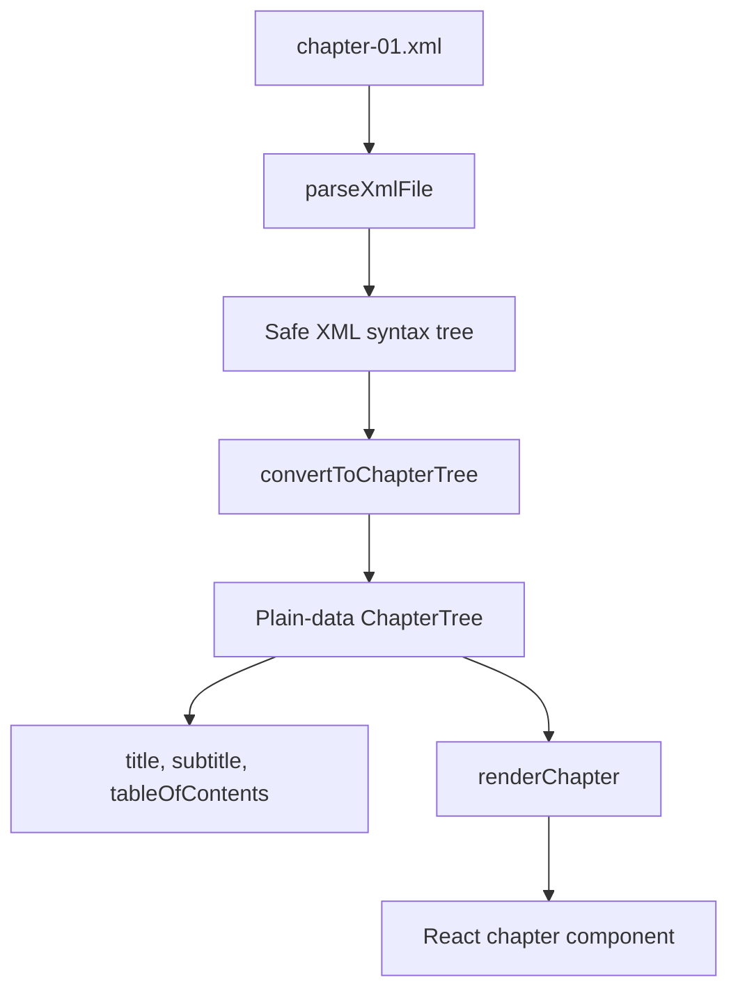

# XML Chapter Parser Architecture

## Overview

The XML chapter parser converts a publisher XML chapter into the same kind of
React chapter component and metadata that the report system previously received
from an MDX module.

The high-level flow is:



Parsing and normalization happen when `loadXmlChapter` is called. The returned
chapter component closes over the normalized plain-data tree, so XML parsing
does not happen during each render.

## Module responsibilities

All parser modules are located in
[`src/lib/xml-chapter/`](./src/lib/xml-chapter/).

### `parseXml.js`

Provides the XML input boundary:

- Reads XML files as UTF-8 with `fs.readFile`.
- Parses XML with `xast-util-from-xml`.
- Removes external `DOCTYPE` declarations before parsing.
- Rejects entity and notation declarations.
- Rejects unexpected processing instructions.
- Converts parser and file-system failures into `XmlChapterError` instances.

This module is server/build-time code because it uses `node:fs/promises`.

### `errors.js`

Defines the parser error model:

- `XmlChapterError` carries file, XML node, attribute, and source-position
  context.
- `formatLocation` formats useful line and column information.
- `createXmlError` provides a small factory for callers that need one.

The error context allows malformed XML, unsupported tags, and invalid
attributes to identify the relevant source location.

### `chapterTree.js`

Converts the parsed XML syntax tree into the normalized plain-data
`ChapterTree`.

Responsibilities include:

- Selecting the narrative `Story` element.
- Extracting chapter title and subtitle metadata.
- Mapping publisher style tags to normalized nodes such as headings,
  paragraphs, lists, quotes, figures, tables, links, and endnote references.
- Converting explicit XML application components into
  `{ type: 'component', name, props, children }` nodes.
- Generating stable heading IDs and a table of contents.
- Coalescing adjacent list items into ordered or unordered lists.
- Ignoring metadata and layout-only XML elements.
- Rejecting unsupported visible XML content.

The resulting tree contains data only. It does not contain React elements or
component instances, which keeps it suitable for validation, rendering, and
future search-index use.

### `attributeParsers.js`

Contains typed and security-conscious XML attribute parsers.

Examples include:

- Required and optional strings.
- Harm/typology values.
- Same-document fragment links.
- Local asset paths.
- Booleans and non-negative numbers.
- Image attributes and XML-to-component property adapters.

The parsers normalize XML strings into the prop shapes expected by the
registered React components and reject unsafe values such as external asset
URLs, traversal paths, and invalid fragment links.

### `componentRegistry.js`

Defines the closed allowlist of XML application components that may be
rendered.

For each approved component it defines:

- The existing React component implementation from
  `src/components/CustomComponents.js`.
- Allowed XML attributes.
- Attribute parsing and validation rules.
- Allowed child categories or component names.

The registry prevents arbitrary XML element names from becoming React
components and validates component structure before it reaches the renderer.
Examples include `Box`, `TohInsight`, `Anchor`, `ChapterImage`, contributor
components, definitions, and `AsksAims` components.

### `renderChapter.js`

Converts a normalized `ChapterTree` into React elements.

It uses a closed mapping for intrinsic elements and supports:

- Headings with generated IDs and depth-specific typography classes.
- Paragraphs, strong/emphasis text, quotes, links, and captions.
- Ordered and unordered lists.
- Figures with safe asset paths.
- Tables and table cells.
- Endnote references.
- Registry-approved application components.

The renderer never turns arbitrary XML names or attributes into React
elements. Application components are resolved through `componentRegistry.js`
and are created with the existing React component implementations.

### `index.js`

Exports the public loader, `loadXmlChapter`.

`loadXmlChapter`:

1. Calls `parseXmlFile`.
2. Calls `convertToChapterTree` with locale, report, chapter, and asset context.
3. Creates a server-renderable `Chapter` component that closes over the tree.
4. Returns an MDX-compatible module-shaped object:

```js
{
  default: Chapter,
  title,
  subtitle,
  tableOfContents,
}
```

This return shape lets the report registry continue to expose the same
properties used by the report and chapter pages.

## End-to-end report integration

The English WDR25 registry is
[`src/reports/en/wdr25/index.js`](./src/reports/en/wdr25/index.js).

Chapter 1 is loaded from XML at module initialization:

```js
import path from 'node:path';
import { loadXmlChapter } from '@/lib/xml-chapter/index.js';

const Chapter01 = await loadXmlChapter({
  filePath: path.join(
    process.cwd(),
    'src',
    'reports',
    'en',
    'wdr25',
    'chapter-01.xml'
  ),
  locale: 'en',
  reportSlug: 'wdr25',
  chapterNumber: 1,
  assetBasePath: '/wdr25/chapter-01',
});
```

The previous MDX registration is no longer used for Chapter 1:

```js
// import * as Chapter01 from './chapter-01.mdx';
```

The registry then uses the loader result in the existing chapter entry:

```js
'chapter-01': {
  component: Chapter01.default,
  title: Chapter01.title,
  subtitle: Chapter01.subtitle,
  tableOfContents: Chapter01.tableOfContents,
  // other report metadata
}
```

Consequently, the rest of the report system does not need to know whether a
chapter came from MDX or XML. It receives a component and metadata through the
same registry contract, while Chapter 1's content is now sourced from
`chapter-01.xml`.

## Runtime boundary

The XML file is read and normalized at build/server-module time. The resulting
React chapter component is rendered later by the report chapter page.

Because the XML loader uses `node:fs/promises`, it must remain on the
server/build side of the application boundary. The XML-backed chapter registry
is therefore intended for server-side report loading; client-side consumers
should use report metadata rather than importing the file-reading parser
directly.
